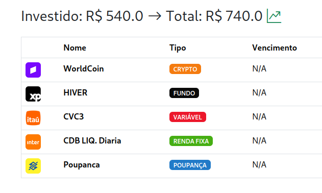

# Investment Manager

A investment management dashboard written in Python using my own "framework"
[mini-mvc](https://github.com/Raisess/mini-mvc), with this tool you can keep
your investments on track at one place.



### Setup the environment 

You only need to run these setup scripts only once:

```shell
bash ./install-deps.sh
bash ./migrate.sh
python3 -m venv __venv
```

Create the `.env` file and paste the next lines on it:

```shell
PRODUCTION=1
DEBUG=0
LOG_LEVEL=INFO
LAZY_LOAD=0
ENABLE_VIEW_COMPRESSION=1
RENDER_EXCEPTION_STACK=0

USE_SESSION=1
SESSION_PERMANENT=0
SESSION_TYPE=filesystem

USE_MEMORY=1

USE_SQLITE=1
SQLITE_DB_PATH=./sqlite.db


# fill those variables with your Google Cloud client info:
USE_GOOGLE_OAUTH2=1
GOOGLE_OAUTH2_CLIENT_ID=
GOOGLE_OAUTH2_CLIENT_SECRET=
GOOGLE_OAUTH2_SCOPES=openid https://www.googleapis.com/auth/userinfo.email https://www.googleapis.com/auth/userinfo.profile

# App Env's
APP_REDIRECT_HOST_BASE=http://localhost:8080
GOOGLE_API_KEY=
```

check on how to do it [here](https://github.com/Raisess/mini-mvc/blob/main/docs/plugins/auth/google_oauth2.md).

### Running localy

Run these commands to start the application:

```shell
source ./__venv/bin/activate
python3 -m ensurepip
python3 -m pip install -r ./requirements.core.txt
python3 -m pip install -r ./requirements.txt
python3 ./src/main.py
```

### Running as a container

Just run:

```shell
./container.sh
```
